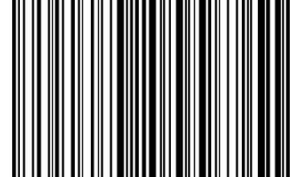

# Генератор QR и штрих кодов

--
## Штрих код
Генератор создает штрих код по технологии code128, используя алфавит В: латиница + цифры

## QR код
Гернератор создает qr код с уровнем коррекции L (до 7% потери изображения) версии до 40

Примеры qr лежат в папке qr